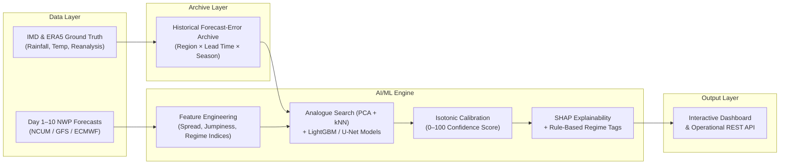
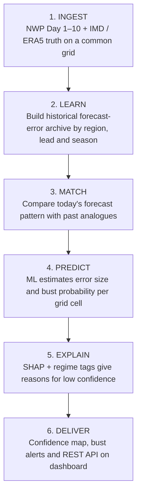
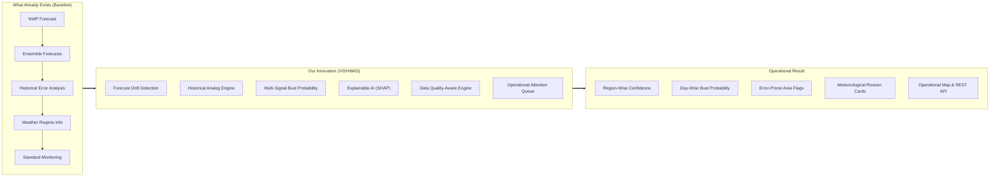
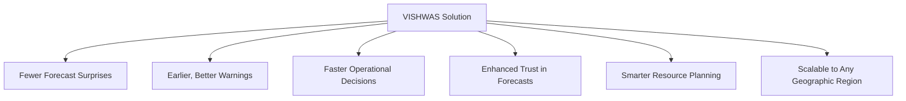

# SIH 2026 | Team Sanjievani (Team ID: 179079)

# VISHWAS: AI-Based Forecast Bust Detection for Medium-Range Weather Forecasts

[](https://www.sih.gov.in/)
[](#problem-statement-details)
[](#problem-statement-details)
[](#problem-statement-details)

---

## 📋 Problem Statement Details

| Parameter | Details |
| :--- | :--- |
| **Problem Statement ID** | **SIH26079** |
| **Problem Statement Title** | **AI-Based Forecast Bust Detection for Medium-Range Weather Forecasts** |
| **Theme** | **Smart Automation** |
| **PS Category** | **Software** |
| **Team ID** | **179079** |
| **Team Name** | **Sanjievani** |
| **System Name** | **VISHWAS (Forecast Confidence & Bust Prediction)** |

---

## 💡 Proposed Solution

**VISHWAS** is an **AI/ML Forecast Confidence & Bust Prediction System** that sits on top of existing Numerical Weather Prediction (NWP) models (e.g., NCUM, GFS, ECMWF). 

It compares the current Day 1–10 forecast pattern with historical forecast-error behaviour and alerts forecasters where and when the forecast is likely to be unreliable. It specifically focuses on critical high-impact weather events:
- **Monsoon Depressions & Low-Pressure Systems**
- **Extreme Rainfall Events**
- **Western Disturbances (WD)**
- **Tropical Cyclones**
- **Heat Waves & Cold Waves**
- **Active / Break Monsoon Phases**



### Key System Layers

1. **Data Layer**:
   - Ingests Day 1–10 NWP forecasts (NCUM / GFS / ECMWF) for the Indian subcontinent onto a standardized common grid.
   - Integrates IMD gridded rainfall & temperature datasets alongside ERA5 reanalysis as ground truth.
   - Builds a multi-year historical forecast-error archive structured by `region × lead time × season`.
   - Automatically tags synoptic weather regimes (monsoon depression, cyclone, western disturbance, heat wave, active/break phase).

2. **AI/ML Engine**:
   - **Analogue Search**: Matches today's forecast pattern with past historical days exhibiting similar circulation, moisture, and ensemble spread (using PCA + kNN).
   - **Error Learning & Prediction**: Uses LightGBM / XGBoost and PyTorch U-Net models to predict error magnitude and bust probability per grid cell and lead time.
   - **Calibration**: Applies Isotonic Regression and Brier scoring to transform raw probabilities into trusted 0–100 forecast confidence scores.
   - **Explainability**: SHAP (SHapley Additive exPlanations) values combined with regime tags provide human-readable meteorological justifications for every alert.

3. **Output Layer**:
   - **Forecast Confidence Map**: Region-wise confidence visualizer across Day 1 to Day 10 lead times.
   - **Bust Probability Metrics**: Quantified risk of large forecast errors over target regions.
   - **Error-Prone Area Detection**: Automatic flagging of geographic zones where NWP guidance is prone to breakdown.
   - **Plain-Language Explanations**: Meteorological key reasons explaining low-confidence flags.
   - **Operational Interface**: Prototype Web Dashboard + REST API designed for seamless forecaster workflows.

---

## 🛠️ Technical Approach & Technologies Used

### Technology Stack Table

| Component | Technology | Purpose |
| :--- | :--- | :--- |
| **Data Ingestion** | Python, `xarray`, `cfgrib`, `netCDF4` | Reads Day 1–10 NWP (NCUM / GFS / ECMWF) and IMD / ERA5 truth data onto a common grid. |
| **Feature Engineering** | `NumPy`, `SciPy`, `pandas` | Builds ensemble spread, model disagreement, run-to-run jumpiness, regime indices (MJO / BSISO), and anomalies. |
| **Analogue Retrieval** | `scikit-learn` (PCA + kNN) | Finds historical days with similar forecast patterns and reads off their past forecast errors. |
| **Bust Prediction** | `LightGBM` / `XGBoost`, `PyTorch` (U-Net) | Predicts error size and bust probability for every grid cell and lead time. |
| **Calibration & Validation** | Isotonic regression, Brier score | Makes probabilities reliable; tested on unseen years and extreme events. |
| **Explainability** | SHAP + rule-based regime tags | Turns model drivers into plain meteorological reasons for low confidence. |
| **Backend & Storage** | Node.js, Express / FastAPI, PostgreSQL / PostGIS, Zarr | Stores forecasts and errors; serves maps and probabilities through a REST API. |
| **Dashboard** | React, HTML5, MapLibre GL / SVG Maps, Plotly, CSS3 | Region-wise confidence maps, Day 1–10 slider, and reason cards for forecasters. |

---

## 🔄 Forecast-Bust Prediction Flowchart



### Core Methodology & Technical Descriptions

- **Learning from Failures**: Historical NWP forecasts are systematically compared with observational ground truth to compile a region-, lead-, and season-wise archive of forecast errors.
- **Bust Definition**: A "bust" is defined as a forecast error exceeding a high percentile threshold (e.g., top 5–10%) of historical errors for that specific region, lead time, and season (fully tunable by forecasters).
- **Analogue Matching**: The active forecast pattern is matched against historical cases sharing similar atmospheric circulation, moisture transport, and ensemble spread to inherit past error dynamics.
- **ML Prediction & Calibration**: Gradient boosting models and spatial U-Nets calculate predicted error magnitude and bust probability per grid cell. Isotonic regression ensures the probability score represents empirical truth.
- **Explainability**: SHAP attribution values and regime tags yield concise, natural-language explanations (e.g., *"High model disagreement over Bay of Bengal low-pressure track"*).
- **Evaluation Framework**: Validated using Brier Score, Reliability Diagrams, ROC-AUC, and out-of-sample testing on independent monsoon seasons and extreme weather events.

---

## 🏛️ System Innovation Architecture



---

## 📊 Feasibility and Viability Analysis

### Feasibility Pillars

1. **Technical Feasibility**:
   - **Data Availability**: Multi-year NWP reforecast archives (TIGGE/NCMRWF) and IMD/ERA5 observational grids are publicly available.
   - **Proven Methods**: Analogue matching, Gradient Boosting, U-Nets, and Isotonic Calibration are mature, robust techniques.
   - **Compute Efficiency**: Model inference runs on standard GPU workstations; forecast cycle evaluation completes in minutes.
   - **Integration**: Native support for standard GRIB / NetCDF input formats with GeoJSON / REST output interfaces.

2. **Operational Feasibility**:
   - **Workflow Integration**: Runs automatically after every NWP cycle, displaying side-by-side with conventional charts.
   - **Usability**: Intuitive, color-coded risk maps featuring single-line meteorological explanations.
   - **Human-in-the-Loop**: Acts as an advisory system—the human forecaster maintains final authority.

3. **Economic Feasibility**:
   - **Low Cost**: Built entirely on an open-source software stack (Python, Node.js, Express, PostGIS, React); zero licensing fees.
   - **Asset Reuse**: Leverages existing observational and NWP networks without requiring new hardware deployment.
   - **High ROI**: Reduces missed extreme weather events and false alarms, minimizing economic damage.

4. **Legal & Ethical Feasibility**:
   - **Data Attribution**: Full compliance with open/institutional data licensing and attribution.
   - **Transparent AI**: Quantified uncertainty prevents over-confidence in automated guidance.

---

### Risk Mitigation Matrix

| Category | Challenges & Risks | Strategies to Overcome |
| :--- | :--- | :--- |
| **Technical** | Few samples of rare extremes | Regime-wise training, class-weighting, and Synthetic Data Augmentation. |
| **Technical** | NWP model upgrades alter error behavior | Rolling-window retraining with continuous model drift monitoring. |
| **Technical** | Spatial & lead-time correlation leakage | Year-wise cross-validation and strict spatial blocking. |
| **Operational** | Forecaster skepticism towards AI output | Build trust via reliability diagrams + plain-language meteorological explanations. |
| **Operational** | Real-time processing latency | Pre-computed raster tiles and REST API caching. |
| **Operational** | Heterogeneous data formats | Standardized GRIB / NetCDF ingestion adapters. |
| **Adoption** | Fitting into agency operational workflows | Pilot deployment first (e.g., single sub-division for one monsoon season). |
| **Adoption** | Data-sharing access constraints | Utilize open-access datasets and formal institutional partnerships. |
| **Adoption** | User training overhead | Simplified UI dashboard accompanied by concise operational training guides. |

---

## 📈 Impact and Benefits



### Detailed Comparison Matrix

| Feature | Raw NWP Forecast | Ensemble Spread | Forecaster Judgement | Forecast Bust System (VISHWAS) |
| :--- | :--- | :--- | :--- | :--- |
| **Uncertainty Info** | None – single deterministic guess. | Shows spread, uncalibrated to past errors. | Subjective; varies per individual. | **Calibrated bust probability & confidence score per region & lead time.** |
| **Learns from Past Errors** | No. | Rarely – spread does not equal true error. | Experience-based; unrecorded & unscalable. | **Yes – analogue matching against historical forecast-error archive.** |
| **Explainability** | None. | Limited to variance/spread plots. | Verbal; unstandardized. | **Key meteorological reasons for every low-confidence flag.** |
| **Coverage** | Grid points without reliability info. | Grid-wide but complex to interpret. | Limited to localized regions under pressure. | **All-India coverage from Day 1 to Day 10.** |
| **Operational Use** | Direct, but no failure warnings. | Requires manual expert interpretation. | Slow and stressful during extreme events. | **Turnkey Map + REST API ready for operational forecasters.** |

---

## 🚀 Future Scope

- **AI-Weather & Multi-Model Ensembles**: Expand ingestion to include AI-based weather models (GraphCast, Pangu-Weather, FourCastNet) and full ensemble suites for richer signals.
- **Extreme-Event Modules**: Dedicated sub-models for specialized cyclone track/intensity confidence and heat-wave onset probabilities.
- **Nowcasting Hand-Off**: Direct integration with Doppler Weather Radar (DWR) and INSAT satellite feeds for seamless short-range updates.
- **Multi-Hazard Advisory Systems**: Downstream integrations for flood inundation, agricultural advisories, and power grid demand management.

---

## 🔬 Research & References

1. **Reanalysis & Observations (ERA5)**: [ECMWF ERA5 Datasets](https://www.ecmwf.int/en/forecasts/datasets/reanalysis-datasets/era5)
2. **Multi-Model Forecast Archive (TIGGE)**: [ECMWF TIGGE Project](https://www.ecmwf.int/en/research/projects/tigge)
3. **Indian Weather Data & Warnings (IMD)**: [India Meteorological Department](https://mausam.imd.gov.in)
4. **Global NWP over India (NCMRWF)**: [National Centre for Medium Range Weather Forecasting](https://www.ncmrwf.gov.in)
5. **Forecast Benchmarking (WeatherBench)**: [Google WeatherBench](https://sites.research.google/weatherbench/)
6. **Gradient Boosting (LightGBM)**: [LightGBM Documentation](https://lightgbm.readthedocs.io)
7. **Explainable ML (SHAP)**: [SHAP Documentation](https://shap.readthedocs.io)

---

## 💻 Project Directory Structure

```text
sih079/
├── data/
│   ├── indiaDistricts.js      # District mapping across Indian States & UTs
│   └── mockData.js            # Historical error archives, confidence scores, & SHAP reasons
├── public/
│   ├── app.js                 # Interactive dashboard logic & map rendering engine
│   ├── index.html             # Operational web application interface
│   └── styles.css             # Modern UI styling & responsive layout grid
├── .env                       # Environment variables (PORT, WEATHERAPI_KEY)
├── .env.example               # Template environment configuration file
├── .gitignore                 # Version control exclusion rules
├── package.json               # Node.js project manifest & dependencies
├── package-lock.json          # Dependency lockfile
├── server.js                  # Express REST API server & static file provider
└── README.md                  # Complete project documentation & technical specification
```

---

## ⚙️ Quickstart & Local Setup Guide

### Prerequisites
- [Node.js](https://nodejs.org/) (v18.0.0 or higher recommended)
- `npm` (v9.0.0 or higher)

### 1. Installation
Clone the repository and install the dependencies:
```bash
git clone <your-repository-url>
cd sih079
npm install
```

### 2. Environment Configuration
Copy the `.env.example` file to create `.env`:
```bash
cp .env.example .env
```
*(Optional: Set your `WEATHERAPI_KEY` in `.env` to enable live weather feed integration)*

### 3. Running the Server
Start the production server:
```bash
npm start
```
Or start in development mode with hot reloading:
```bash
npm run dev
```

Open your browser and navigate to:
```text
http://localhost:3000
```

---

## 🌐 Prototype REST API Endpoints

The VISHWAS backend exposes the following RESTful API endpoints for operational integration:

| Method | Endpoint | Description |
| :--- | :--- | :--- |
| `GET` | `/api/status` | Returns backend operational status and active weather feed health. |
| `GET` | `/api/regions` | Returns list of supported Indian regions and sub-divisions. |
| `GET` | `/api/confidence-map` | Retrieves region-wise confidence map data for Day 1–10 lead times. |
| `GET` | `/api/forecast` | Returns detailed Day 1–10 forecast confidence and bust probabilities. |
| `GET` | `/api/explainability` | Fetches SHAP feature attributions and meteorological key reasons. |
| `GET` | `/api/events` | Lists high-impact weather regimes (depressions, cyclones, heat waves). |
| `GET` | `/api/alerts` | Serves active forecast bust warnings and low-confidence flags. |

---

<p center="align">
  <b>Developed by Team Sanjievani for Smart India Hackathon 2026</b><br>
  <i>Smarter Forecasts. Safer Decisions.</i>
</p>
